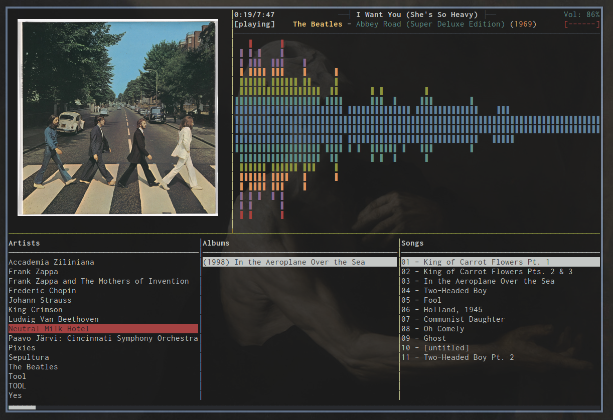

# MusicPlayerPlus Configuration

MusicPlayerPlus includes customized configuration for the Music Player Daemon
(MPD), the MPD client `mpcplus`, a spectrum visualizer `mppcava`, the `tmux`
terminal multiplexer, and the `tmuxp` tmux session manager.

## MPD configuration

The installed MusicPlayer MPD configuration files are located in
`~/.config/mpd/`.

The default `~/.config/mpd/mpd.conf` indludes the following:

```
music_directory		"~/.config/mpd/music"
playlist_directory		"~/.config/mpd/playlists"
db_file			"~/.config/mpd/tag_cache"
log_file			"~/.config/mpd/log"
pid_file			"~/.config/mpd/pid"
state_file			"~/.config/mpd/state"
sticker_file                   "~/.config/mpd/sticker.sql"

bind_to_address		"localhost"

input {
        plugin "curl"
}

input {
        enabled    "no"
        plugin     "qobuz"
}

input {
        enabled      "no"
        plugin       "tidal"
}

decoder {
        plugin                  "hybrid_dsd"
        enabled                 "no"
}

decoder {
       plugin                   "wildmidi"
       enabled                  "no"
       config_file              "/etc/timidity/timidity.cfg"
}

audio_output {
	type		"alsa"
	name		"My ALSA Device"
    buffer_time "50000"   # (50ms); default is 500000 microseconds (0.5s)
}

audio_output {
	type		"fifo"
	name		"Visualizer feed"
	path		"~/.config/mpd/mpd.fifo"
	format		"44100:16:2"
}

filesystem_charset		"UTF-8"
```

See the [MPD README](config/mpd/README.md).

## MPD client mpcplus configuration

MPD client `mpcplus` default configuration is located in
`~/.config/mpcplus/config` and includes the following:

```
mpd_music_dir = ~/.config/mpd/music
visualizer_data_source = ~/.config/mpd/mpd.fifo
visualizer_output_name = Visualizer feed
visualizer_in_stereo = yes
visualizer_type = spectrum
visualizer_look = "+|"
visualizer_color = 47, 83, 119, 155, 191, 227, 221, 215, 209, 203, 197, 161
visualizer_spectrum_smooth_look = no
playlist_shorten_total_times = yes
playlist_display_mode = columns
browser_display_mode = columns
search_engine_display_mode = columns
playlist_editor_display_mode = columns
autocenter_mode = yes
centered_cursor = yes
progressbar_look = ▃_▃
user_interface = alternative
screen_switcher_mode = media_library, playlist, browser
startup_screen = media_library
locked_screen_width_part = 60
display_bitrate = yes
external_editor = vim
use_console_editor = yes
header_window_color = cyan
volume_color = red
state_line_color = yellow
state_flags_color = red:b
progressbar_color = cyan
progressbar_elapsed_color = cyan:b
statusbar_color = cyan
```

MPD client `mpcplus` default key bindings are located in
`~/.config/mpcplus/bindings` and includes the following:

```
def_key "alt-1"
  run_external_command "/usr/bin/set_term_trans 0.1"

def_key "alt-2"
  run_external_command "/usr/bin/set_term_trans 0.2"

def_key "alt-3"
  run_external_command "/usr/bin/set_term_trans 0.3"

def_key "alt-4"
  run_external_command "/usr/bin/set_term_trans 0.4"

def_key "alt-5"
  run_external_command "/usr/bin/set_term_trans 0.5"

def_key "alt-6"
  run_external_command "/usr/bin/set_term_trans 0.6"

def_key "alt-7"
  run_external_command "/usr/bin/set_term_trans 0.7"

def_key "alt-8"
  run_external_command "/usr/bin/set_term_trans 0.8"

def_key "alt-9"
  run_external_command "/usr/bin/set_term_trans 0.9"

def_key "alt-0"
  run_external_command "/usr/bin/set_term_trans 1.0"

def_key "alt-f"
  run_external_command "/usr/bin/mppfzmp"

def_key "alt-r"
  run_external_command "/usr/bin/raise_cava"
```

## Spectrum visualizer mppcava configuration

The default `mppcava` spectrum visualizer configuration file is located at
`~/.config/mppcava/config`. MusicPlayerPlus `mppcava` configuration includes:

```
[general]
bar_width = 1
higher_cutoff_freq = 20000

[input]
method = fifo
source = ~/.config/mpd/mpd.fifo
sample_rate = 44100
sample_bits = 16

[color]
gradient = 1
gradient_count = 8
gradient_color_1 = '#59cc33'
gradient_color_2 = '#80cc33'
gradient_color_3 = '#a6cc33'
gradient_color_4 = '#cccc33'
gradient_color_5 = '#cca633'
gradient_color_6 = '#cc8033'
gradient_color_7 = '#cc5933'
gradient_color_8 = '#cc3333'

[smoothing]
gravity = 77
```

MusicPlayerPlus `mppcava` is a customized fork of the Cava spectrum visualizer.
See the [Cava README](mppcava/README.md) for more info on Cava.

## Terminal multiplexer tmux configuration

The `tmux` terminal multiplexer is a powerful and complex system.
It allows multiple terminal sessions to  be accessed simultaneiously
in a single window. It is useful for running more than one command-line
program at the same time. It can also be used to detach processes from
their controlling terminals, allowing remote sessions to remain active
without being visible.

Although powerful and extremely useful, `tmux` is not frequently employed
by most users due to its complexity. There is a steep learning curve.

MusicPlayerPlus attempts to surmount that hurdle by providing a sophisticated
`tmux` configuration out of the box. The `mpcinit` utility, executed after
installing MusicPlayerPlus, installs a `tmux` configuration file located at
`~/.tmux.config` which automatically sets up tmux key bindings and settings
making it easy to incorporate tmux into a user's routine.

The default `~/.tmux.conf` that MusicPlayerPlus installs includes:

```
bind-key -n M-PgDn next-window
bind-key -n M-PgUp previous-window
bind-key -n M-Left select-pane -L
bind-key -n M-Right select-pane -R
bind-key -n M-Up select-pane -U
bind-key -n M-Down select-pane -D
bind-key -n M-x confirm-before -p "kill-session #S? (y/n)" kill-session
bind-key -n M-X kill-session
unbind C-b
set-option -g prefix C-a
bind-key C-a send-prefix
bind-key r source-file ~/.tmux.conf\; display ' Reloaded tmux config.'
bind-key | split-window -h -c '#{pane_current_path}'
bind-key - split-window -v -c '#{pane_current_path}'
unbind '"'
unbind %
bind-key -n S-Left  previous-window
bind-key -n S-Right next-window
bind-key s set-window-option synchronize-panes

set-window-option -g pane-base-index 1
set-window-option -g history-limit 1000000
set-window-option -g window-status-style fg=colour244,bg=default #base0 and default
set-window-option -g window-status-current-style fg=colour166,bg=default #orange and default
set-window-option -g window-status-bell-style fg=colour235,bg=colour160 #base02, red
set-option -g base-index 1
set-option -g mouse on
set-option -g status-position bottom
set-option -g status-justify left
set-option -g status-left-length 50
set-option -g status-left '#{?client_prefix,#[bg=colour10 fg=colour0] Ctrl #[default] ,}'
set-option -g status-right-length 100
set-option -g status-right "#[fg=cyan]%A, %d %b %Y %I:%M %p"
set-option -g status-style fg=colour136,bg=default
set-option -g message-style fg=colour166,bg=colour235 #orange and base02
set-option -g display-time 1000
set-option -g repeat-time 1000
set-option -g default-terminal "xterm-256color"
set-option -ga terminal-overrides ',*-256color*:Tc'
set-option -g pane-border-style fg=colour235 #base02
set-option -g pane-active-border-style fg=colour240 #base01
set-option -g display-panes-active-colour colour33 #blue
set-option -g display-panes-colour colour166 #orange
set-option -g visual-activity off
set-option -g visual-bell off
set-option -g visual-silence off
set-option -g bell-action none
set-window-option -g monitor-activity off
```

## Tmuxp configuration

MusicPlayerPlus `tmuxp` configuration files are YAML format
files used to manage `tmux` sessions with tmuxp. MusicPlayerPlus
provides tmuxp configuration files for `fzmp`, `mpcplus`, and
`mppsplash` tmux sessions.

See the [TMUXP README](config/tmuxp/README.md).

## Adding album art to MusicPlayerPlus

**MusicPlayerPlus** includes the really nice character based mpd client
**mpcplus**. It has all the functionality one would need, but sadly it
has no built-in way of showing album art for the current playing song
as rendering images via a terminal emulator is pretty tricky.

MusicPlayerPlus includes commands and `tmux` integration to enable the
display of album cover art in a tmux pane alongside `mpcplus` and `mppcava`.
What follows is a technical deepdive into how this was accomplished.

Here you will learn how to include album art in your mpcplus client and
include the mppcava spectrum visualizer while browsing songs. Luckily, you
will not have to copy and paste these files and setup the system yourself.
The MusicPlayerPlus package contains all the configuration, scripts, dependencies,
and a convenience startup command. To run `mpcplus` with spectrum visualization
and album art all you need to do is execute the `mpcplus-tmux` command.
If your music library contains album art in the album folders then it will
be displayed alongside the visualizer and MPD client.

The final result would be something like this:



## Prerequisites

To start off, a few dependencies need to be installed:

-   tmux           (to encapsulate everything in one window)
-   inotify-tools  (for changing album art when switching songs)
-   ueberzug       (for image rendering)
-   ffmpeg         (used in scaling the album art)
-   mpc            (cli client for MPD)

### Tmux
Tmux should already be installed either as a base package for your
Linux distribution or as a MusicPlayerPlus dependency. If it is not
installed (try `type -p tmux`) then install
[tmux](https://github.com/tmux/tmux/wiki) with:

```
sudo apt install tmux
```

### Inotify-tools
Install [inotify-tools](https://github.com/inotify-tools/inotify-tools) with:

```
sudo apt install inotify-tools
```

### Ueberzug
Install [Ueberzug](https://github.com/seebye/ueberzug) with:

```
python -m pip install ueberzug
```

### Ffmpeg
Install [ffmpeg](http://www.ffmpeg.org/) with:

```
sudo apt install ffmpeg
```

### Mpc
Mpc should already be installed as a MusicPlayerPlus dependency.
If it is not installed (try `type -p mpc`) then install
[mpc](https://www.musicpd.org/clients/mpc/) with:

```
sudo apt install mpc
```

## Setup

### Displaying cover images

The basic idea is that each time the song changes it triggers a script
that searches for an album cover and copies it in `/tmp` as
`album_cover.png`. Another script listens for changes on that file and
renders the new image in the terminal.

Start by creating a script named `album_cover.sh` in `~/.config/mpcplus/`:

```
source "`ueberzug library`"

function add_cover {
  ImageLayer::add [identifier]="img" [x]="1" [y]="2" [path]="${COVER}"
}

if [ -f ${HOME}/.config/mpcplus/config ]
then
  MPCDIR=".config/mpcplus"
else
  if [ -f ${HOME}/.mpcplus/config ]
  then
    MPCDIR=".mpcplus"
  else
    mpcinit
    MPCDIR=".config/mpcplus"
  fi
fi

COVER=${HOME}/${MPCDIR}/album_cover.png

ImageLayer 0< <(
if [ ! -f "${COVER}" ]; then
  cp ${HOME}/${MPCDIR}/default_cover.png ${COVER}
fi
while inotifywait -q -q -e close_write "${COVER}"; do
  add_cover
done
)
```

This is going to listen for album cover changes and render them.

If no album cover for the current song is found, a default image will be
selected. Be sure to add one named `default_cover.png` in `~/.config/mpcplus/`.

Now create `cover_obs.sh` in the same directory:

```
if [ -f ${HOME}/.config/mpcplus/config ]
then
  MPCDIR=".config/mpcplus"
else
  if [ -f ${HOME}/.mpcplus/config ]
  then
    MPCDIR=".mpcplus"
  else
    mpcinit
    MPCDIR=".config/mpcplus"
  fi
fi

COVER="${HOME}/${MPCDIR}/album_cover.png"
COVER_SIZE="400"

mpd_music=`grep ^music_directory /etc/mpd.conf`
if [ "${mpd_music}" ]
then
  MUSIC_DIR=`echo ${mpd_music} | awk ' { print $2 } ' | sed -e "s/\"//g"`
else
  mpd_music=`grep ^mpd_music_dir ${HOME}/${MPCDIR}/config`
  if [ "${mpd_music}" ]
  then
    MUSIC_DIR=`echo ${mpd_music} | awk ' { print $3 } '`
  else
    MUSIC_DIR=${HOME}/Music
  fi
fi

file="${MUSIC_DIR}/$(mpc --format %file% current)"
album="${file%/*}"
art=$(find "${album}"  -maxdepth 1 | grep -m 1 ".*\.\(jpg\|png\|gif\|bmp\)")
if [ "${art}" = "" ]; then
  art="${HOME}/${MPCDIR}/default_cover.png"
fi
ffmpeg -loglevel 0 -y -i "${art}" -vf "scale=${COVER_SIZE}:-1" "${COVER}"
```

This is the script executed when switching songs. It searches for images
in the directory of the current song.

Here I chose a render size of 400 x 400, but it can be anything.

Tell mpcplus to execute it every time the song changes by adding this to
`~/.config/mpcplus/config-art.conf`

```
    execute_on_song_change = "~/.config/mpcplus/cover_obs.sh"
```

And don't forget to make them executable

```
    chmod +x album_cover.sh
    chmod +x cover_obs.sh
```

### Wrapping everything in one window

As mentioned above, we use tmux to run multiple terminal based programs in a
single window so that everything fits nicely (i.e. an instance of `mpcplus`,
an instance of `mppcava`, and one terminal running our image rendering script).

MusicPlayerPlus includes commands that start a tmux session and configures
the tmux panes. Start a tmux session displaying `mpcplus`, the `mppcava` spectrum
visualizer, and album art in separate tmux panes by executing the command:

```
mpcplus-tmux
```

You can take a look at
<a href="https://github.com/doctorfree/MusicPlayerPlus/tree/master/config" target="_blank"> the complete config files</a>.
